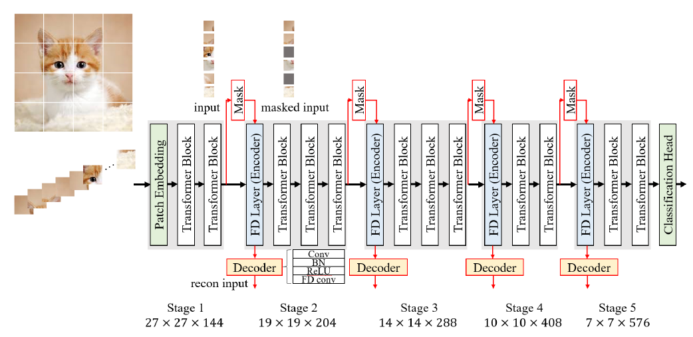

## FDViT: Improve the Hierarchical Architecture of Vision Transformer (ICCV 2023)

**Yixing Xu, Chao Li, Dong Li, Xiao Sheng, Fan Jiang, Lu Tian, Ashish Sirasao** | [Paper](https://openaccess.thecvf.com/content/ICCV2023/papers/Xu_FDViT_Improve_the_Hierarchical_Architecture_of_Vision_Transformer_ICCV_2023_paper.pdf)

Advanced Micro Devices, Inc.

</img>

---

## Dependancies

```bash
torch == 1.13.1
torchvision == 0.14.1
timm == 0.6.12
einops == 0.6.1
```

## Model performance

The image classification results of FDViT models on ImageNet dataset are shown in the following table.

|Model|Parameters (M)|FLOPs(G)|Top-1 Accuracy (%)|
|-|-|-|-|
|[FDViT-Ti](https://drive.google.com/file/d/1JTm1nJnKrQVEMF19uAKbwFqKR5wv6z4a/view?usp=sharing)|4.6|0.6|73.74|
|[FDViT-S](https://drive.google.com/file/d/1Dmg-EB4x_ke2XxcHEnCNSuRYwGddKG0Q/view?usp=sharing)|21.6|2.8|81.45|
|[FDViT-B](https://drive.google.com/file/d/1qhRSCeNgS_ZWXNLq2peSu7ubYBP-9Yqv/view?usp=sharing)|68.1|11.9|82.39|

## Model Evaluation

```bash
python -m torch.distributed.launch --nproc_per_node=1 --use_env main.py --model fdvit_ti --data-path /path/to/imagenet/ --resume /path/to/tiny_model/ --eval
```

## Model Training

FDViT-Ti

```bash
python -m torch.distributed.launch --nproc_per_node=8  --use_env main.py --model fdvit_ti --opt adamp --batch-size 256 --data-path /path/to/imagenet/--output_dir ./output/fdvit_ti/ --epochs 300 --warmup-epochs 20 --ratio 0.03 --mask_thre 0.2
```

FDViT-S

```bash
python -m torch.distributed.launch --nproc_per_node=8  --use_env main.py --model fdvit_s --opt adamp --batch-size 256 --data-path /path/to/imagenet/--output_dir ./output/fdvit_s/ --epochs 300 --warmup-epochs 20 --ratio 0.03 --mask_thre 0.2
```

FDViT-B

```bash
python -m torch.distributed.launch --nproc_per_node=8  --use_env main.py --model fdvit_b --opt adamp --batch-size 256 --data-path /path/to/imagenet/--output_dir ./output/fdvit_b/ --epochs 300 --warmup-epochs 20 --ratio 0.03 --mask_thre 0.2
```

## Citation

```
@inproceedings{xu2023fdvit,
  title={FDViT: Improve the Hierarchical Architecture of Vision Transformer},
  author={Xu, Yixing and Li, Chao and Li, Dong and Sheng, Xiao and Jiang, Fan and Tian, Lu and Sirasao, Ashish},
  booktitle={Proceedings of the IEEE/CVF International Conference on Computer Vision},
  pages={5950--5960},
  year={2023}
}
```
